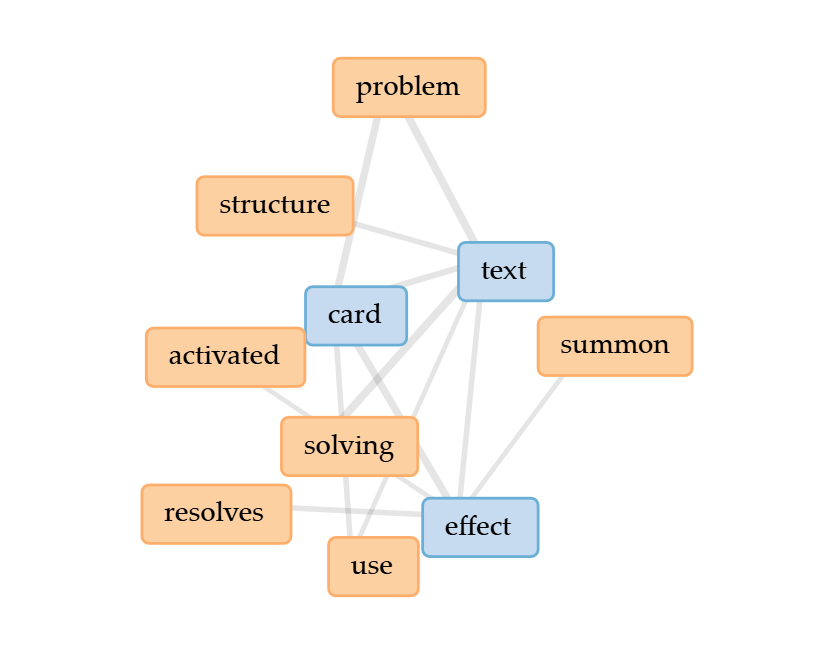



# Distant Reading Assignment 

I used Voyant to search this website! [Yugoih Website](https://yugioh.fandom.com/wiki/Problem-Solving_Card_Text)

I learned about Problem-Solving Card Text (PSCT), and how it makes it easier to understand the different effects of cards and reduce confussion during gameplay.

This is my image! 

Here are some of the responses from CoPilot:

PSCT (Problem-Solving Card Text) is designed so you can “read” exactly how a card works just from its punctuation and phrasing.
Here’s a compact guide to what you can reliably discern at a glance, plus a few tricky nuances that often decide rulings.

The PSCT blueprint (colon & semicolon)
Think of most effect lines as:

[Activation condition(s)] : [Cost/Targeting] ; [Effect/Resolution]
Text before the colon “:
Activation condition(s) or timing windows. This is when you’re allowed to activate.

Example: “When a card or effect is activated … (Quick Effect): …”

Text after the colon but before the semicolon “;”
Costs you must pay and/or targets you declare at activation.

Example: “… You can discard this card; …” (discarding is the cost)

Text after the semicolon “;”
The effect that resolves.

Example: “… negate that effect.”

If an effect line has no colon/semicolon, it usually doesn’t create its own Chain Link. (Normal Spell/Trap activations always create a Chain Link, but the effect text itself may not use PSCT punctuation.)

---
The text I looked at about Problem-Solving Card Text (PSCT) is very detailed and mainly focused on rules, structure, and exact wording. Using distant reading tools showed me patterns. Like how often colons, semicolons, and certain phrases are used, which points to the importance of clear and consistent rules in the game. These tools can show what kinds of words or writing styles appear most often. This helps explain the text’s purpose, such as being rule focused instead of storytelling or persuasive.
